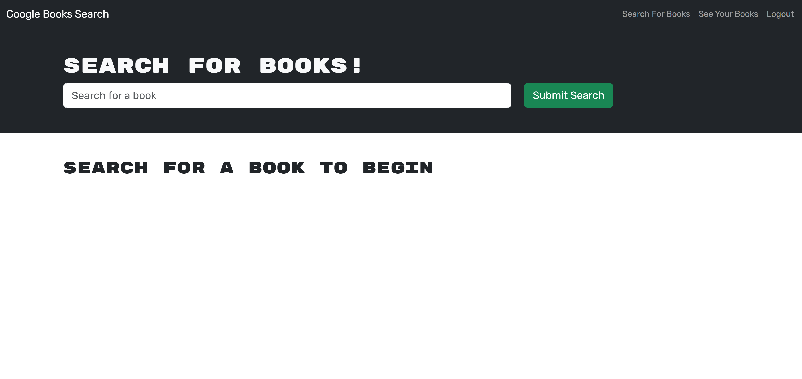
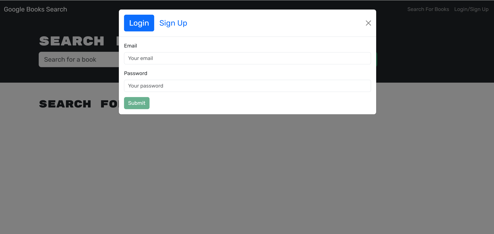
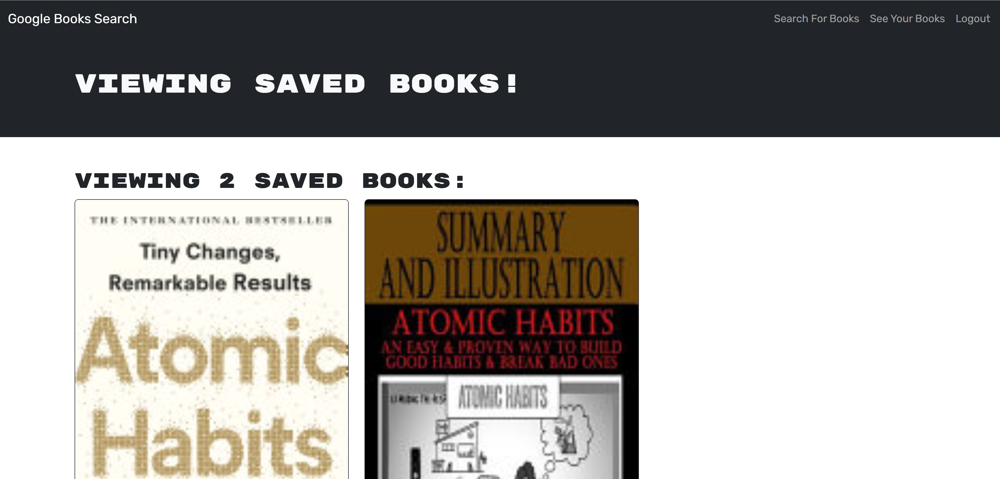

# GoogleBook

## Description

GoogleBook is a fully functioning book search engine built using the Google Books API. Originally developed as a RESTful API using the MERN stack (MongoDB, Express.js, React, and Node.js), it has been refactored to use GraphQL with Apollo Server. Users can search for books and save their favorite searches to the backend.

## Features

- Search for books using the Google Books API.
- Save and manage book searches.
- User authentication with JSON Web Token (JWT).
- GraphQL API with Apollo Server.
- Front-end built with React.
- Backend powered by MongoDB, Node.js, and Express.js.
- Deployed on Render.

## Technologies Used

- Front End: React, Apollo Client
- Back End: Node.js, Express.js, MongoDB, Apollo Server
- Authentication: JSON Web Token (JWT)
- Deployment: Render

## Installation 

1. Clone the repository:
   ```bash
   git clone https://github.com/Nikky0910/Chall21-GoogleBook.git
   ```
2. Navigate to the project directory:
   ```bash
   cd googlebook
   ```
3. Install dependencies for the server and client:
   ```bash
   npm install
   cd client && npm install
   ```
4. Set up environment variables in a `.env` file in the root directory:
   ```
   MONGODB_URI=your_mongodb_uri
   JWT_SECRET=your_jwt_secret
   API_KEY=your_api_key
   ```
5. Start the development servers:
   ```bash
   npm run develop
   ```

## File Structure

```
project-directory/
|-- client/
|   |-- src/
|   |   |-- components/
|   |   |-- pages/
|   |   |-- utils/
|   |   |-- App.js
|   |   |-- index.js
|-- server/
|   |-- models/
|   |-- schemas/
|   |   |-- resolvers.js
|   |   |-- typeDefs.js
|   |-- server.js
|-- .env
|-- package.json
```

## Usage

- Use the search bar to look for books.
- Click "Save" to store books in your user profile.
- View saved books on your profile page.
- Register/Login to access personalized features.

## Deployment

Link to the GitHub repository:

<a href = "https://github.com/Nikky0910/Chall21-GoogleBook.git"> Github Repo</a>

Link to the deployed application on Render: 

<a href = "https://chall21-googlebook.onrender.com/"> GoogleBook website</a>

The live website should look as follows:



 


## License

[](https://opensource.org/licenses/MIT)